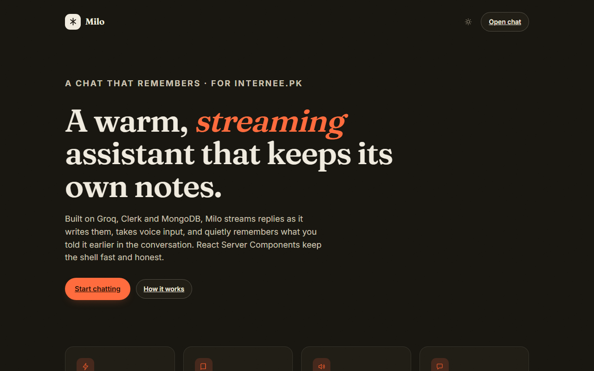
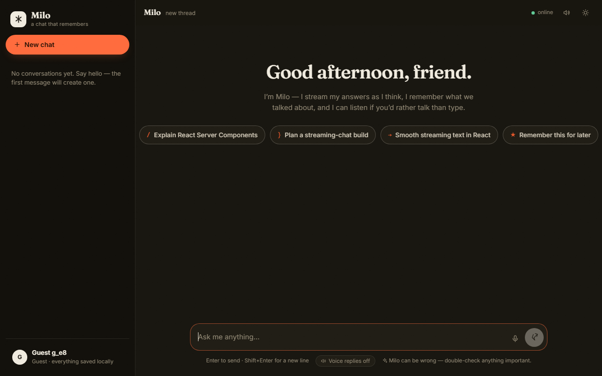

# Milo — a chat that remembers

Task 4 for the **internee.pk React internship** — a streaming, voice-enabled
chatbot built with Next.js (App Router), Groq / OpenAI / Gemini, Clerk and
MongoDB.

Milo streams replies token-by-token, keeps a distilled long-term memory of each
conversation, and listens if you'd rather talk than type.

---

## Screenshots

| Landing page | Chat workspace |
| --- | --- |
|  |  |

## Tech stack

- **Framework** — Next.js 16 (App Router), React 19, TypeScript
- **Streaming** — Server-Sent Events (`/api/chat`) + React Suspense
- **AI** — provider-agnostic (`lib/ai.ts`): Groq, OpenAI, or Gemini, with
  Whisper transcription for voice input
- **Voice output** — browser `SpeechSynthesis` (chunked, cancellable)
- **Persistence** — MongoDB via Mongoose, with a local JSON fallback
  (`lib/json-store.ts`)
- **Auth** — Clerk (optional; guest mode without keys)
- **Realtime** — `ws` WebSocket server (`ws-server.mjs` / `server.mjs`)
- **Styling** — hand-written CSS with CSS variables and a light/dark theme

---

## Features

| Requirement | Where in the code |
| --- | --- |
| User authentication (Clerk) | `app/layout.tsx`, `lib/identity.ts`, `components/AuthFooter.tsx` |
| Streaming AI responses + Suspense | `app/chat/page.tsx` (Suspense shell), `app/api/chat/route.ts` (SSE), `lib/ai.ts` |
| Message history persistence (MongoDB) | `lib/models.ts`, `lib/persistence.ts`, `lib/db.ts` |
| Voice input / output (Whisper / TTS) | `app/api/transcribe/route.ts`, `lib/voice.ts`, `lib/ai.ts` |

Also covered: React Server Components, optimistic UI updates, a WebSocket
realtime channel, and multi-turn conversations with memory (`lib/memory.ts`).

## What Milo does

- **Streams as it thinks.** Replies arrive over Server-Sent Events and render
  inside a React Suspense boundary — no spinners, just a blinking caret.
- **Remembers.** Every few exchanges the assistant quietly distils the thread
  into a compact memory note that later turns lean on, so follow-ups feel
  contextual instead of cold.
- **Listens and speaks.** Hit the mic button, Groq's Whisper transcribes you,
  and replies can read themselves aloud in the browser.
- **Realtime by default.** A WebSocket keeps presence, typing indicators and new
  replies in sync across open tabs.
- **Works with any OpenAI-compatible provider.** Flip `AI_PROVIDER` to switch
  between Groq, OpenAI and Gemini without touching app code. The model name
  shows up in the chat header.

## Getting started

**Prerequisites:** Node.js 20+ and npm.

```bash
npm install
npm run dev
```

The dev server starts at [http://localhost:3000](http://localhost:3000). The
WebSocket realtime server runs alongside it at [ws://localhost:3001/ws](ws://localhost:3001/ws) (the
client connects there via `NEXT_PUBLIC_WS_URL`).

> **Worth knowing:** MongoDB is the primary store, but if it's unreachable Milo
> falls back to a local JSON file in `./data` so you can still develop. Same
> for Clerk — leave the keys empty and you run as a guest with locally-saved
> chats.
>
> Some VPN / DNS-filter tools refuse the SRV lookups Atlas uses. `lib/db.ts`
> detects this and retries through a public resolver, so `mongodb+srv://` URIs
> keep working.

## Environment variables

Copy `.env.example` to `.env.local` and fill in the gaps.

| Variable | Purpose | Default |
| --- | --- | --- |
| `AI_PROVIDER` | `groq`, `openai` or `gemini` | `groq` |
| `GROQ_API_KEY` | Chat + Whisper transcription (recommended) | — |
| `OPENAI_API_KEY` | Chat + Whisper transcription | — |
| `GEMINI_API_KEY` | Chat only (no transcription with a plain key) | — |
| `AI_MODEL` | overrides the model for the active provider | provider default |
| `MONGODB_URI` | Atlas connection string | falls back to `./data/store.json` |
| `NEXT_PUBLIC_CLERK_PUBLISHABLE_KEY` | Clerk auth (paste both keys to enable) | guest mode |
| `CLERK_SECRET_KEY` | Clerk auth | guest mode |
| `WS_PATH` | WebSocket endpoint | `/ws` |
| `NEXT_PUBLIC_WS_URL` | Full WebSocket URL for dev (separate port) | same-origin `/ws` |

## Project structure

```
├── app/
│   ├── page.tsx              # Landing page (Server Component)
│   ├── chat/page.tsx         # Chat workspace with Suspense shell
│   └── api/
│       ├── chat/route.ts     # POST → SSE streaming chat
│       ├── conversations/    # List / create / delete conversations
│       ├── messages/         # Load a conversation's messages
│       └── transcribe/       # Whisper audio transcription
├── components/
│   ├── ChatShell.tsx         # Chat state machine (streaming, memory, realtime)
│   └── chat/                 # Composer, Thread, Sidebar, Welcome, Markdown
├── lib/
│   ├── ai.ts                 # Provider-agnostic AI + Whisper clients
│   ├── memory.ts             # Prompt window + distilled long-term memory
│   ├── db.ts / json-store.ts # MongoDB or local JSON persistence
│   ├── identity.ts           # Clerk auth + guest sessions
│   ├── use-realtime.ts       # WebSocket hook (presence, typing, sync)
│   └── voice.ts              # Speech output + mic recording
├── dev.mjs                   # Dev runner: next dev + realtime server
├── server.mjs                # Production server: Next + WebSocket on one port
└── ws-server.mjs             # Standalone realtime WebSocket server
```

## How it works

**Server-rendered shell, client-rendered chat.** The routes are React Server
Components; the chat workspace suspends over an initial conversation load so
the first paint is instant and the shell shows a skeleton instead of a blank
screen (`app/chat/page.tsx`).

**Streaming.** `app/api/chat/route.ts` reads the provider's streaming response
and re-emits it as a Server-Sent Events stream. The client appends each `delta`
to the message as it lands, giving the "typing" feel without a spinner.

**Optimistic UI.** The user's message appears the moment they press send — the
server is the source of truth and updates state on completion.

**Memory.** `lib/memory.ts` builds the model prompt from the recent window plus
a compact long-term note. After a few exchanges a background task distils the
thread into an updated note (`distillMemory`), so nothing is lost and the
context stays small.

**Realtime.** In dev (`dev.mjs`) a standalone `ws` server (`ws-server.mjs`) runs
on port 3001 while `next dev` runs on 3000, so the dev app hydrates cleanly. In
production `server.mjs` runs Next and the WebSocket server on one port. Typing
indicators, presence and finished replies fan out to every open tab.

## Scripts

| Command | Meaning |
| --- | --- |
| `npm run dev` | `next dev` (port 3000) + realtime server (port 3001) via `dev.mjs` |
| `npm run build` | Production build |
| `npm run start` | Production server + WebSocket, same port (via `server.mjs`) |
| `npm run start:prod` | Production server only (`next start`) |
| `npm run ws` | Run just the realtime server (`ws-server.mjs`) |
| `npm run lint` | ESLint |

## License

[MIT](LICENSE) — free to use, modify and share.